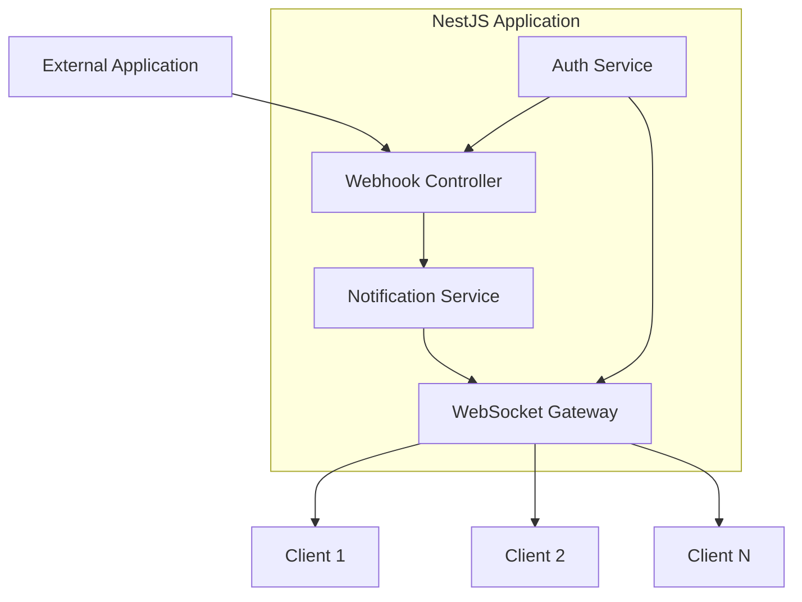

# Design Document

## Overview

El servicio de notificaciones por WebSockets será implementado como un módulo independiente en la aplicación NestJS existente. El sistema constará de dos componentes principales: un controlador HTTP que expone un webhook para recibir notificaciones de aplicaciones externas, y un gateway WebSocket que maneja las conexiones de clientes y la distribución de notificaciones en tiempo real.

El diseño aprovecha la arquitectura modular de NestJS y se integra con el sistema de autenticación JWT existente para proporcionar seguridad tanto en el webhook como en las conexiones WebSocket.

## Architecture

### High-Level Architecture



### Module Structure

```
src/
├── notification/
│   ├── notification.module.ts
│   ├── controllers/
│   │   └── webhook.controller.ts
│   ├── gateways/
│   │   └── notification.gateway.ts
│   ├── services/
│   │   └── notification.service.ts
│   ├── dto/
│   │   ├── webhook-notification.dto.ts
│   │   └── websocket-notification.dto.ts
│   ├── interfaces/
│   │   └── notification.interface.ts
│   └── guards/
│       ├── webhook-auth.guard.ts
│       └── ws-auth.guard.ts
```

## Components and Interfaces

### 1. Notification Module (`notification.module.ts`)

Módulo principal que encapsula toda la funcionalidad de notificaciones.

**Dependencies:**
- `@nestjs/websockets`
- `@nestjs/platform-socket.io`
- `socket.io`

**Providers:**
- NotificationService
- NotificationGateway
- WebhookController

### 2. Webhook Controller (`webhook.controller.ts`)

Controlador REST que expone el endpoint para recibir notificaciones de aplicaciones externas.

**Endpoints:**
- `POST /api/notifications/webhook` - Recibe notificaciones externas

**Responsibilities:**
- Validar autenticación del webhook (API key/token)
- Validar formato de la notificación
- Delegar el procesamiento al NotificationService
- Retornar respuestas HTTP apropiadas

### 3. WebSocket Gateway (`notification.gateway.ts`)

Gateway que maneja las conexiones WebSocket y la distribución de notificaciones.

**WebSocket Events:**
- `connection` - Cliente se conecta
- `disconnect` - Cliente se desconecta
- `notification` - Envío de notificación a clientes

**Responsibilities:**
- Autenticar conexiones WebSocket usando JWT
- Mantener registro de clientes conectados por user ID
- Distribuir notificaciones a clientes específicos o broadcast
- Manejar desconexiones y limpieza de recursos

### 4. Notification Service (`notification.service.ts`)

Servicio central que coordina el procesamiento y distribución de notificaciones.

**Methods:**
- `processWebhookNotification(notification, targetUsers?)` - Procesa notificaciones del webhook
- `broadcastNotification(notification)` - Envía notificación a todos los clientes
- `sendToUsers(notification, userIds)` - Envía notificación a usuarios específicos
- `addClient(userId, socketId)` - Registra cliente conectado
- `removeClient(socketId)` - Remueve cliente desconectado
- `getConnectedUsers()` - Obtiene lista de usuarios conectados

## Data Models

### WebhookNotificationDto

```typescript
export class WebhookNotificationDto {
  @IsString()
  @IsNotEmpty()
  type: string;

  @IsString()
  @IsNotEmpty()
  message: string;

  @IsOptional()
  @IsArray()
  @IsString({ each: true })
  targetUsers?: string[];

  @IsOptional()
  @IsObject()
  data?: Record<string, any>;

  @IsOptional()
  @IsString()
  priority?: 'low' | 'normal' | 'high';
}
```

### WebSocketNotificationDto

```typescript
export class WebSocketNotificationDto {
  id: string;
  type: string;
  message: string;
  data?: Record<string, any>;
  priority: 'low' | 'normal' | 'high';
  timestamp: Date;
  source: 'webhook' | 'system';
}
```

### Connected Client Interface

```typescript
export interface ConnectedClient {
  socketId: string;
  userId: string;
  connectedAt: Date;
}
```

## Error Handling

### Webhook Errors

1. **Authentication Errors (401)**
   - Token inválido o faltante
   - Token expirado

2. **Validation Errors (400)**
   - Formato de notificación inválido
   - Campos requeridos faltantes
   - Tipos de datos incorrectos

3. **Server Errors (500)**
   - Errores internos del servicio
   - Fallos en la distribución de notificaciones

### WebSocket Errors

1. **Connection Errors**
   - Autenticación fallida durante handshake
   - Token JWT inválido o expirado

2. **Runtime Errors**
   - Pérdida de conexión de cliente
   - Errores en el envío de mensajes
   - Fallos en la serialización de datos

### Error Response Format

```typescript
export interface ErrorResponse {
  statusCode: number;
  message: string;
  error: string;
  timestamp: string;
  path: string;
}
```

## Authentication & Security

### Webhook Authentication

- **Method:** Bearer Token en header Authorization
- **Implementation:** Custom Guard que valida API key configurada
- **Configuration:** Token almacenado en variables de entorno

```typescript
@UseGuards(WebhookAuthGuard)
@Post('webhook')
async receiveNotification(@Body() notification: WebhookNotificationDto) {
  // Implementation
}
```

### WebSocket Authentication

- **Method:** JWT Token durante handshake
- **Implementation:** Custom Guard que valida JWT y extrae user ID
- **Token Source:** Query parameter o header durante conexión

```typescript
@UseGuards(WsAuthGuard)
@WebSocketGateway({
  cors: { origin: '*' },
  namespace: '/notifications'
})
export class NotificationGateway {
  // Implementation
}
```

## Testing Strategy

### Unit Tests

1. **NotificationService Tests**
   - Procesamiento de notificaciones webhook
   - Distribución a usuarios específicos vs broadcast
   - Gestión de clientes conectados
   - Manejo de errores

2. **WebhookController Tests**
   - Validación de autenticación
   - Validación de DTOs
   - Respuestas HTTP correctas
   - Manejo de errores

3. **NotificationGateway Tests**
   - Autenticación de conexiones WebSocket
   - Registro y limpieza de clientes
   - Envío de notificaciones
   - Manejo de desconexiones

### Integration Tests

1. **End-to-End Webhook Flow**
   - Envío de notificación via webhook
   - Verificación de recepción en clientes WebSocket
   - Notificaciones dirigidas vs broadcast

2. **WebSocket Connection Flow**
   - Conexión con autenticación válida
   - Rechazo de conexiones no autenticadas
   - Recepción de notificaciones en tiempo real

3. **Error Scenarios**
   - Manejo de tokens inválidos
   - Comportamiento con clientes desconectados
   - Recuperación de errores de red

### Performance Tests

1. **Load Testing**
   - Múltiples conexiones WebSocket simultáneas
   - Alto volumen de notificaciones webhook
   - Distribución eficiente a muchos usuarios

2. **Memory Management**
   - Limpieza correcta de conexiones cerradas
   - Gestión de memoria con muchos clientes
   - Prevención de memory leaks

## Configuration

### Environment Variables

```env
# Webhook Authentication
WEBHOOK_API_TOKEN=your-secure-api-token

# WebSocket Configuration
WS_CORS_ORIGIN=*
WS_NAMESPACE=/notifications

# JWT Configuration (existing)
JWT_SECRET=your-jwt-secret
JWT_EXPIRES_IN=24h
```

### Module Configuration

```typescript
@Module({
  imports: [
    JwtModule.register({
      secret: process.env.JWT_SECRET,
      signOptions: { expiresIn: process.env.JWT_EXPIRES_IN },
    }),
  ],
  controllers: [WebhookController],
  providers: [NotificationService, NotificationGateway],
  exports: [NotificationService],
})
export class NotificationModule {}
```

## Deployment Considerations

### Dependencies

Nuevas dependencias requeridas en `package.json`:

```json
{
  "dependencies": {
    "@nestjs/websockets": "^10.0.0",
    "@nestjs/platform-socket.io": "^10.0.0",
    "socket.io": "^4.7.0"
  },
  "devDependencies": {
    "@types/socket.io": "^3.0.0"
  }
}
```

### Scaling Considerations

1. **Horizontal Scaling**
   - Uso de Redis Adapter para Socket.IO en múltiples instancias
   - Sincronización de estado entre instancias

2. **Connection Limits**
   - Configuración de límites máximos de conexiones WebSocket
   - Monitoreo de uso de memoria y CPU

3. **Monitoring**
   - Métricas de conexiones activas
   - Latencia de distribución de notificaciones
   - Tasa de errores en webhook y WebSocket